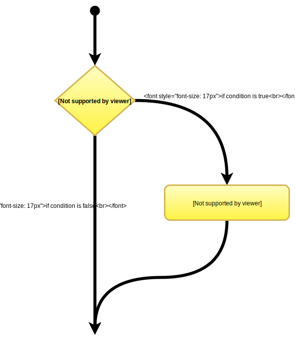
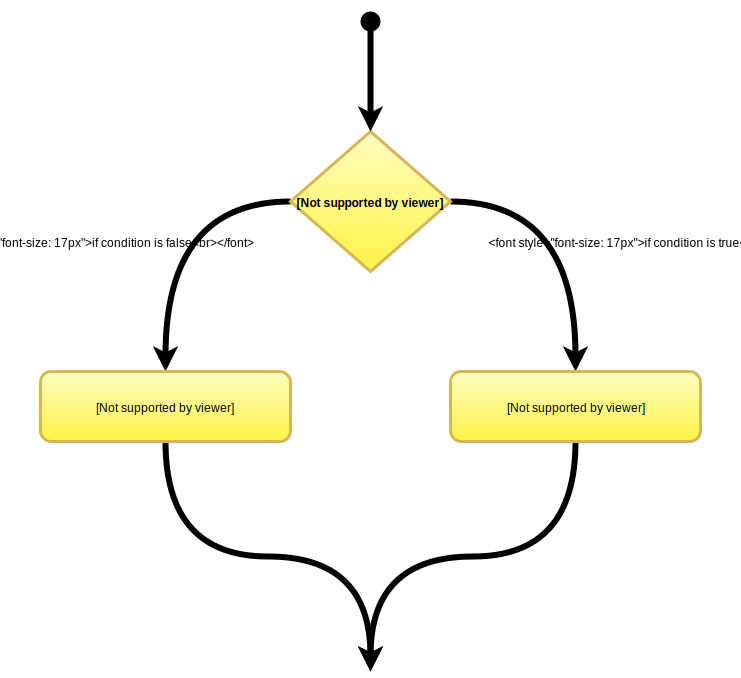
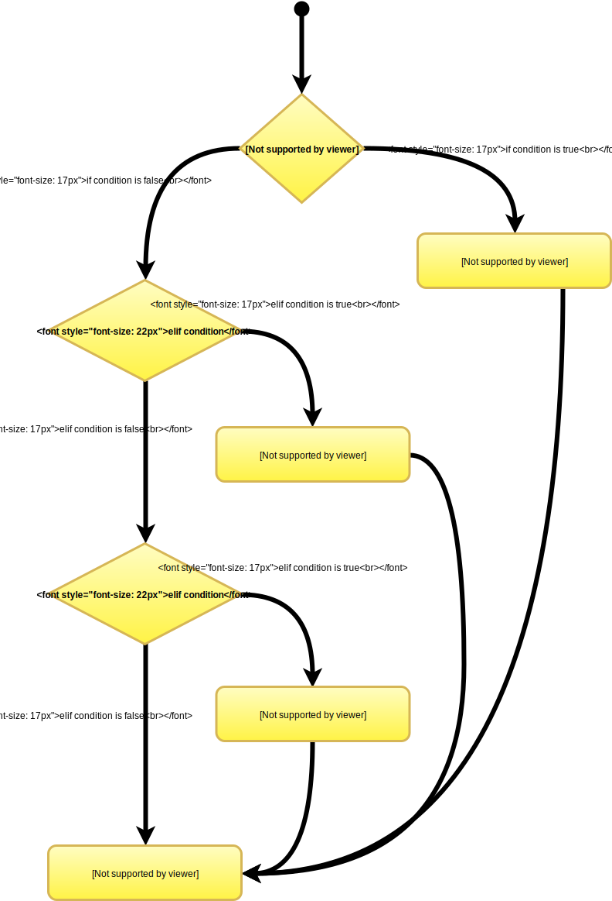

Control Structures
===================

Quantum computing excluded, all programming languages execute each of the statements line by line.  So how do we control the execution of the statements? What if we want to execute a line of code before another? This is where control structures come into play.

Throughout this section we will discuss each of the following control structures and where they can be used:

* if statements
* else statements
* elif (else if) statements
* while loops
* for loops

There is one more try ... except, but we will cover this later.

Once you reach the point where you need to use control structures in your code, you should probably be primarily entering your code as a Python script and only using the interactive interpreter for checking / debugging.  Of course you can enter the code into interpreter, but it is far less time consuming and generally more convenient that the interpreter.

General Control Structure
-------------------------

Almost all programming languages use a similar syntax to specify control structures. They pretty much all follow the format (ignore the < > symbols, they are simply being used to denote the start and end of particular fields):

| **<name of structure>** <a test condition which if true the program will execute>
|   <some character to indicate the start of the structure>
|   <the statements to execute within the structure>
|   <some character to indicate the end of the structure>

Test Conditions and Relational Operators
-----------------------------------------
The test conditions are the key to control structures and usually are the source of head scratching when troubleshooting incorrect programming flow within the code.  A control structure will execute only if the test condition is ``True`` or **non-zero**.  By convention in programming and computer science an integer value of 0 is interpreted as ``False`` and any non-zero character is interpreted as ``True``. 
``True`` and ``False`` are keywords within Python and can be assigned to variables as values.  

.. note::
    A **Keyword** is a reserved tag within Python that cannot be used as names of variables

So for clarification, if a variable or statement evaluates to be the following it will be considered as ``False``:

* Zero (0)
* An empty string ("")
* ``False``
* ``None`` (another keyword, we will cover this later)

Relational / Comparative Operators
------------------------------------

The following operators can be used to make comparisons within Python:

.. table:: Relational Operators
   :widths: auto

   ========  ========================
   Symbol    Meaning
   ========  ======================== 
   >         Greater than
   <         Less than
   >=        Greater than or equal to
   <=        Less than or equal to
   ==        The same as 
   !=        Not the same as
   ========  ========================

.. note:: Exercise
   Try out some of the operators in the interpreter

   .. code:: python 

      100 > 10
      12 < 123
      11 >= 11
      age = 23 # Note assignment not comparison
      limit = 40 # Note assignment not comparison
      age >= limit
      age == limit
      age != limit
      True == False
      True != True
      True == True

Compounding Relational Operators
--------------------------------

You can join relational expressions together to test multiple expressions at the same time.  These compound tests can
be completed using:

.. table::

    ========= =====================================================================================
    Operator  Operation
    ========= =====================================================================================
    ``and``   Logical And (two statements must **both** be True for the result to be True
    ``or``    Logical Or (**either** one of the statements must be True for the result to be True)
    ``not``   Inverse the result of the statement (True becomes False and vice versa)
    ========= =====================================================================================

.. note:: Exercise
   Try out some of the operators in the interpreter

   .. code:: python 

      (100 < 10) and (100 > 10)
      (100 > 10) and (100 > 10)
      result = (10 > 100) or (10 < 100)
      not_result = not result
      
      result = (10 > 100) or (10 > 100)
      not_result = not result

if Statement
-------------

The ``if`` statement will only execute specific code if the test condition is ``True``.  If the test condition is not
``True`` the program will ignore the conditional code.  

The structure of an ``if`` statement in Python syntax is as follows:

.. code:: python
   :number-lines:

   if condition_is_true:
       statement_1
       statement_2
   statement_3 # Not executed as part of the if statement

So what is important here?

1. The ``if`` keyword which indicates the control structure is an ``if`` statement.
2. The condition to execute
3. The colon at the end of line 1, this indicates that the following statements are to be part of the control structure
4. The newline after the colon.
5. The indentation of each of the lines within the statement.  This is really important and can be confusing, the
   statements within the structure must be indented by the **same amount**.  If they are not, either a syntax error will
   be thrown or the statement will not be executed.
6. The control structure is terminated by a new line.  

.. tip:: **PEP8 Tip**
    Use 4 spaces to indent the line NOT the TAB key, this is almost a universal Python convention.  Depending on the
    text editor TAB can be interpreted differently and can give painful results when moving between text editors.  One
    of the great things about the IDLE editor is that indentation is mostly handled for you, once you press the enter
    key after a **colon (:)** the next line is automatically indented.

    Keep this in mind as indentation is used everywhere in Python!!

Example if statements:

.. doctest::

   >>> if True:
   ...     print("The if statement worked!")
   The if statement worked!

   >>> if False:
   ...     print("The if statement did not work")
   >>> print("Does this statement print?")
   Does this statement print?

   >>> age = 18
   >>> if (age >= 18): # 18 is the Legal age of drinking in Australia ;)
   ...     print("Sweet, let's have a beer!") 
   ...     print("Or maybe something else...?")
   Sweet, let's have a beer!
   Or maybe something else...?

   >>> if "":
   ...     print("Blank string is True?") 

.. tip::
   Do not hesitate to use brackets or parentheses to group expressions and control the order of operation.  It is good
   practice, ensures correct execution and adds to clarity to group statements with brackets.

else Statement
--------------

The ``else`` statement will only execute specified code if the test condition is ``False``.  If the test condition is ``True`` the
statements within the ``if`` structure will be executed and **NOT** the statements following the ``else`` statement.  The ``else``
statement will execute last.

The structure of an ``else`` statement in Python syntax is as follows:

.. code:: python
   :number-lines:

   if condition_is_false:
       statement_1
       statement_2
   else:
       statement_4
       statement_5
   statement_3 # Not executed as part of the if statement

So what is important here? 

1. The ``if`` statement: you cannot have an ``else`` statement without an ``if`` statement
2. The test condition of the ``if`` statement must evaluate to ``False``
3. The ``else`` keyword on its own line
4. The colon (:) following the ``else`` statement, this indicates that the following statements are part of the control structure
5. The new line after the colon (:)
6. The indentation of each of the lines within the statement.  All the same rules apply as with the ``if`` statement.

You can only have **one** else statement in an if/else structure.

Let's try some more examples:

.. doctest::

   >>> if False:
   ...     print("The if statement worked!")
   ... else:
   ...     print("The else statement worked!")
   The else statement worked!

   >>> age = 17
   >>> if (age >= 18): # 18 is the Legal age of drinking in Australia ;)
   ...     print("Sweet, let's have a beer!") 
   ... else:
   ...     print("Or maybe something else...?")
   Or maybe something else...?

   >>> if "":
   ...     print("Blank string is True?") 
   ... else:
   ...     print("The blank string is not True")
   The blank string is not True

else if (elif) Statement
-------------------------

The ``elif`` (else if) statement allows for additional conditions to be added to the control structure.  The statements within the ``elif``
structure will only be executed **if and only if** the test condition with the original if statement is ``False`` and the test
condition of the ``elif`` statement is ``True``. 
 

Unlike the else and if statements, you can have multiple elif statements within a single control structure.  This allows
for responding to multiple conditions.  In C / C++ / Java this is similar to a switch statement. Python does not have
the concept of a switch statement, instead use ``elif`` statements.

The structure of an ``elif`` statement in Python syntax is as follows:

The structure of an ``elif`` statement in Python syntax is as follows:

.. code:: python
   :number-lines:

   if condition_is_false:
       statement_1
       statement_2
   elif condition_is_true:
       statement_6
       statement_7
   else:
       statement_4
       statement_5
   statement_3 # Not executed as part of the if statement

